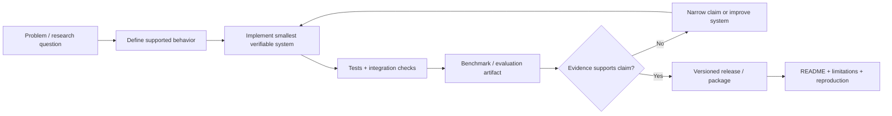
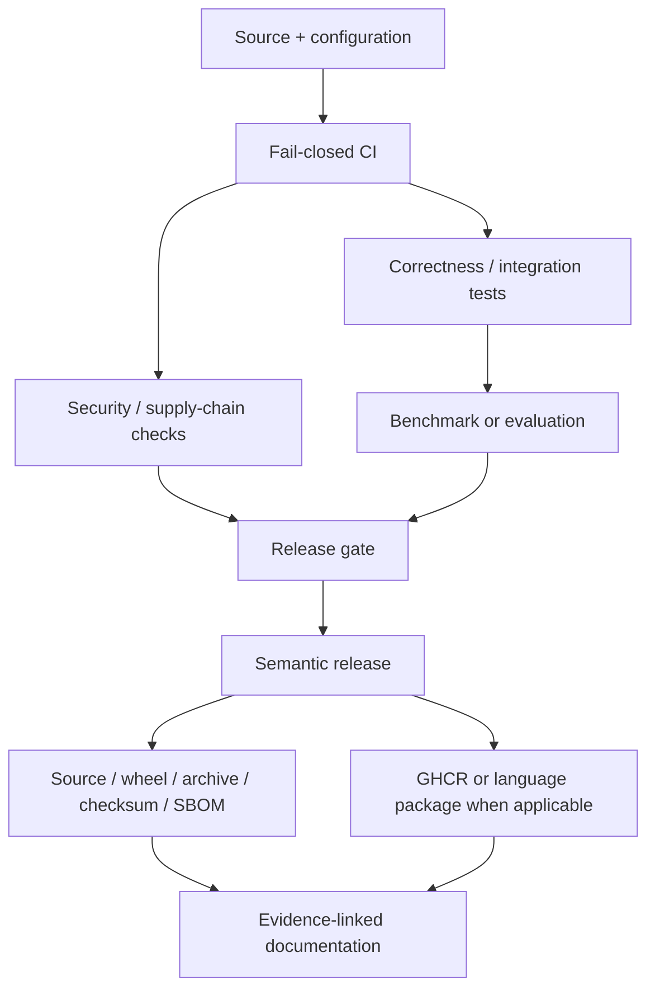

# Corey Leath — Software, Platform & ML Systems Engineering

[](https://github.com/CoreyLeath-code)
[](PORTFOLIO_EVIDENCE.md)
[](https://github.com/CoreyLeath-code/Readme.md/releases/latest)
[](#role-oriented-review-paths)

I am a Software Development student building **verifiable software systems** across platform/reliability engineering, backend and distributed systems, ML infrastructure, data engineering, and quantitative research.

The portfolio is intentionally evidence-first: a strong claim should point to **code, tests, CI, a reproducible command, a versioned artifact, a measured benchmark, or an explicit limitation**. I do not treat a diagram as a deployed system, a microbenchmark as a production SLO, or a synthetic ML result as real-world model quality.

> **Portfolio boundary:** these repositories are engineering/research artifacts with different maturity levels. A GitHub Release or container proves delivery discipline; it does not by itself prove production authorization, safety, profitability, model quality, or internet-scale reliability.

## 60-second proof

As of the dated evidence snapshot, this account exposes **29 public repositories**. The table below verifies the strongest flagship evidence instead of asking a reviewer to infer quality from repository count.

| Engineering signal | Direct evidence |
|---|---|
| Durable runtime / reliability controls | [HelixAgent](https://github.com/CoreyLeath-code/HelixAgent): governed tools, approval gates, bounded retries/budgets, SQLite checkpoints, observability, versioned release |
| Service failure boundaries | [IntelliOps-AI](https://github.com/CoreyLeath-code/IntelliOps-AI): Go gateway validation, bounded bodies, dependency timeouts, deliberate 502/503 mapping, Prometheus/Grafana |
| Reproducible observability research | [SentinelAI](https://github.com/CoreyLeath-code/SentinelAI): PSI/KS reference logic, seeded benchmark artifact, Go/C++/Python service topology |
| Tested local operational tooling | [LogSight-AI](https://github.com/CoreyLeath-code/LogSight-AI): packaged CLI, explainable heuristics, 50 tests, fail-closed quality/security gates |
| Low-level systems / C++ | [neural-network-from-scratch-cpp](https://github.com/CoreyLeath-code/neural-network-from-scratch-cpp): C++17 implementation, GCC/Clang, sanitizers, Valgrind, coverage gate, CPack release |
| Evidence-bounded ML engineering | [SafeSight-AI](https://github.com/CoreyLeath-code/SafeSight-AI) and [Facial Expression Classification](https://github.com/CoreyLeath-code/Facial-Emotion-Recognition-System): explicit model/evaluation boundaries rather than unsupported accuracy claims |
| Event-driven / integration engineering | [Scalable Ride-Sharing Platform](https://github.com/CoreyLeath-code/Scalable-Event-Driven-Ride-Sharing-Platform): Kafka/Redis/RabbitMQ adapters, NGINX/Redis integration and failure-readiness testing |
| Quant research correctness | [AlgoQuant Backtester](https://github.com/CoreyLeath-code/Algo-Quant-Backtester-): one-bar execution lag, explicit turnover costs, deterministic benchmark/release contract |

**Detailed dated evidence:** [PORTFOLIO_EVIDENCE.md](PORTFOLIO_EVIDENCE.md)

---

## Verified flagship evidence

These numbers are intentionally scope-limited. Follow the repository links for the protocol, environment, raw artifacts, and limitations.

| Repository | Verified snapshot | Shipped evidence |
|---|---|---|
| [HelixAgent](https://github.com/CoreyLeath-code/HelixAgent) | 200/200 successful deterministic runs; **8.629 ms p95** orchestration latency on the documented local benchmark; model/provider/network latency excluded | [v1.1.0](https://github.com/CoreyLeath-code/HelixAgent/releases/tag/v1.1.0), source checksum, reproduction record, CycloneDX SBOM, GHCR release path |
| [SentinelAI](https://github.com/CoreyLeath-code/SentinelAI) | 20,000 seeded reference evaluations; **54.7 µs p95**, about **23,031 ops/s**; synthetic F1 1.000 only on deliberately separated seeded cases | [v0.1.0](https://github.com/CoreyLeath-code/SentinelAI/releases/tag/v0.1.0), deterministic source/checksum, versioned ingestion container |
| [LogSight-AI](https://github.com/CoreyLeath-code/LogSight-AI) | **50 tests**, **95.26% core coverage**, **10.315 ms median** on a documented 1,000-line development workload | [v0.1.0](https://github.com/CoreyLeath-code/LogSight-AI/releases/tag/v0.1.0), wheel + source distribution |
| [SafeSight-AI](https://github.com/CoreyLeath-code/SafeSight-AI) | **50 tests** across Python 3.10/3.11/3.12, **96.24% coverage**, explicit `/ready` 503 without a reviewed model | [v0.1.0](https://github.com/CoreyLeath-code/SafeSight-AI/releases/tag/v0.1.0), wheel/sdist/source/benchmark/checksums/SBOM + GHCR |
| [AlgoQuant Backtester](https://github.com/CoreyLeath-code/Algo-Quant-Backtester-) | **84.65% core coverage**, 3-version CI, fixed-seed 5,000-row benchmark contract, one-bar execution lag and explicit costs | [v0.1.0](https://github.com/CoreyLeath-code/Algo-Quant-Backtester-/releases/tag/v0.1.0), wheel/sdist/source/benchmark/checksums/SBOM + GHCR |
| [Neural Network from Scratch — C++](https://github.com/CoreyLeath-code/neural-network-from-scratch-cpp) | C++17 forward/backprop, **>=90% line-coverage gate**, ASan/UBSan, Valgrind, CodeQL, deterministic benchmark JSON | [v1.0.0](https://github.com/CoreyLeath-code/neural-network-from-scratch-cpp/releases/tag/v1.0.0), CPack Linux archive + SHA-256 manifest + GHCR workflow |

### Why one result can be “TBD” and still strengthen the portfolio

[Facial Expression Classification](https://github.com/CoreyLeath-code/Facial-Emotion-Recognition-System) deliberately leaves accuracy/F1/calibration/latency **TBD** because no reviewed checkpoint plus immutable held-out evaluation artifact is committed. That is a stronger research signal than publishing an untraceable headline metric.

---

## Role-oriented review paths

### Platform / SRE / DevOps

Start with:

1. [IntelliOps-AI](https://github.com/CoreyLeath-code/IntelliOps-AI) — gateway failure contracts, timeouts, race tests, Prometheus/Grafana, containers and release automation.
2. [HelixAgent](https://github.com/CoreyLeath-code/HelixAgent) — bounded execution, checkpoints, retries/timeouts, approval gates, health/observability and supply-chain controls.
3. [LogSight-AI](https://github.com/CoreyLeath-code/LogSight-AI) — local operational tooling, deterministic heuristics, packaging, coverage and CI/security gates.
4. [Scalable Event-Driven Ride-Sharing Platform](https://github.com/CoreyLeath-code/Scalable-Event-Driven-Ride-Sharing-Platform) — broker adapters, Redis-backed readiness, NGINX load balancing and integration failure testing.

### ML systems / MLOps

Start with:

1. [SentinelAI](https://github.com/CoreyLeath-code/SentinelAI) — model-observability architecture and reproducible drift-reference evidence.
2. [DeepSequence-Recommender](https://github.com/CoreyLeath-code/DeepSequence-Recommender) — chronological data contracts, ranking evaluation, checksummed model bundles and fail-closed serving.
3. [SafeSight-AI](https://github.com/CoreyLeath-code/SafeSight-AI) — image/API validation and fail-closed model readiness.
4. [TransformerForge](https://github.com/CoreyLeath-code/TransformerForge) — deterministic CI path separated from optional transformer execution.

### Low-level / algorithmic depth

Start with [neural-network-from-scratch-cpp](https://github.com/CoreyLeath-code/neural-network-from-scratch-cpp): forward propagation, backpropagation, gradient descent and ownership remain visible without a tensor framework, while the engineering boundary adds sanitizers, static analysis, coverage, packaging and container validation.

### Quantitative research

Start with [AlgoQuant Backtester](https://github.com/CoreyLeath-code/Algo-Quant-Backtester-): the supported path explicitly models execution lag and turnover costs and separates research simulation from broker connectivity or profitability claims.

---

## Claim-to-evidence map

| Claim | Where to verify it |
|---|---|
| Python backend/API engineering | HelixAgent, SafeSight-AI, TransformerForge, LogSight-AI |
| Go service engineering | IntelliOps-AI, SentinelAI |
| C++ implementation and tooling | neural-network-from-scratch-cpp, SentinelAI |
| C#/.NET engineering | [Software3-Lab](https://github.com/CoreyLeath-code/Software3-Lab) |
| Event-driven integration | Scalable Event-Driven Ride-Sharing Platform |
| Model monitoring / MLOps | SentinelAI, DeepSequence-Recommender |
| Reproducible research benchmarks | HelixAgent, SentinelAI, LogSight-AI, SafeSight-AI, AlgoQuant, IntelliOps-AI |
| Release / package engineering | Follow each repository’s Releases and package links; flagship examples are recorded in [PORTFOLIO_EVIDENCE.md](PORTFOLIO_EVIDENCE.md) |
| Data engineering | [NYC Finance Data Engineering](https://github.com/CoreyLeath-code/NYC-Finance-Data-Engineering-Project), [AWS SageMaker Snowflake ML Pipeline](https://github.com/CoreyLeath-code/AWS-SageMaker-Snowflake-ML-Pipeline) |

---

## Engineering architecture



The loop is **claim → implementation → verification → measurement → release → reproducibility**. If the evidence does not support the original claim, the preferred outcome is to narrow the claim rather than decorate it.

## Portfolio system design



Not every repository implements every box. Repository-level README and workflow files define the actual supported contract.

---

## Technical focus — demonstrated, not merely listed

**Platform / reliability:** Docker, Kubernetes, GitHub Actions, Prometheus, Grafana, OpenTelemetry, health/readiness semantics, dependency timeouts, fail-closed behavior, release/SBOM workflows.

**Backend / distributed systems:** Python/FastAPI, Go, C#/.NET, C++, REST, Redis, Kafka, RabbitMQ, NGINX, event-driven architecture.

**ML systems:** PyTorch, model/runtime validation, monitoring, ranking evaluation, deterministic fallbacks, reproducible ML/research protocols.

**Data / research:** SQL, Pandas, PostgreSQL, Snowflake-oriented workflows, ETL/data contracts, quantitative simulation and reproducible benchmark artifacts.

A technology appearing in a legacy experiment is not treated as equivalent to a CI-validated supported path. The representative repositories above are the evidence map.

---

## Reproducibility standard

For benchmark or ML claims, the preferred record is:

1. exact command;
2. commit SHA or release tag;
3. runtime/dependency versions;
4. dataset or fixture provenance;
5. seed when applicable;
6. warm-up policy;
7. sample/repeat count;
8. machine or CI-runner context;
9. raw machine-readable output;
10. interpretation and explicit exclusions.

### Evidence boundaries I preserve

- **Coverage ≠ correctness.** It only describes executed code coverage under a test suite.
- **Microbenchmark ≠ production SLO.** Production capacity requires representative concurrency, I/O, saturation, errors and resources.
- **Synthetic evaluation ≠ real-world model quality.** Dataset provenance and leakage controls matter.
- **Container image ≠ production authorization.** Packaging is a delivery artifact.
- **Architecture diagram ≠ deployed distributed system.** Integration and failure tests are separate evidence.
- **Dependency in a prototype ≠ supported runtime capability.** CI/release scope decides what is actually verified.

---

## Quick reviewer workflow

```bash
# For any flagship repository:
# 1. Read the evidence boundary near the top of README.
# 2. Inspect tests and GitHub Actions workflows.
# 3. Follow the latest semantic release.
# 4. Re-run the documented benchmark or validation command.
# 5. Compare README numbers with the machine-readable artifact.
# 6. Check what the project explicitly does NOT claim.
```

For the portfolio-level evidence snapshot, read [PORTFOLIO_EVIDENCE.md](PORTFOLIO_EVIDENCE.md).

---

## Reviewer Q&A

**Are these all production systems?**  
No. They range from research scaffolds and reference implementations to more complete service/runtime projects. The repository README defines the supported surface.

**Why publish releases and packages for portfolio projects?**  
They prove repeatable delivery mechanics: version selection, build gates, artifact generation, package/container creation and rollback-identifiable snapshots. They do not automatically establish real-world operating maturity.

**Why include limitations so prominently?**  
Because the ability to identify what evidence does *not* prove is part of engineering judgment. A narrower falsifiable claim is more useful than a broad untestable one.

**What is the strongest SRE/platform evidence?**  
IntelliOps-AI, HelixAgent, LogSight-AI and the event-driven ride-sharing platform: failure boundaries, health/readiness, timeouts, observability, integration tests and release automation are directly inspectable.

**What is the strongest ML-systems evidence?**  
SentinelAI and DeepSequence-Recommender for monitoring/evaluation and artifact discipline; SafeSight-AI and the facial-expression scaffold for explicit fail-closed and research-validity boundaries.

**Where is the algorithmic/low-level work?**  
The C++ neural-network repository exposes forward/backpropagation and memory ownership while enforcing compiler, sanitizer, coverage and static-analysis gates.

---

## Current improvement priorities

The portfolio no longer needs more repositories for breadth. Higher-value improvements are now:

- deeper live/cloud deployment evidence for selected flagships rather than repeating the same stack across more projects;
- stronger Linux/networking/SLO/failure-injection artifacts for SRE-oriented review;
- real versioned evaluation datasets/checkpoints for ML projects before publishing quality metrics;
- consistency between GitHub **About** descriptions and the evidence-bounded README language;
- branch/ruleset governance and required status checks on flagship repositories;
- short demo/walkthrough videos that show the reproducibility path rather than only the UI.

---

## Connect

- **GitHub:** [CoreyLeath-code](https://github.com/CoreyLeath-code)
- **LinkedIn:** [Corey Leath](https://www.linkedin.com/in/corey-leath)

> **Build the system. Test the claim. Measure the result. Publish the evidence.**