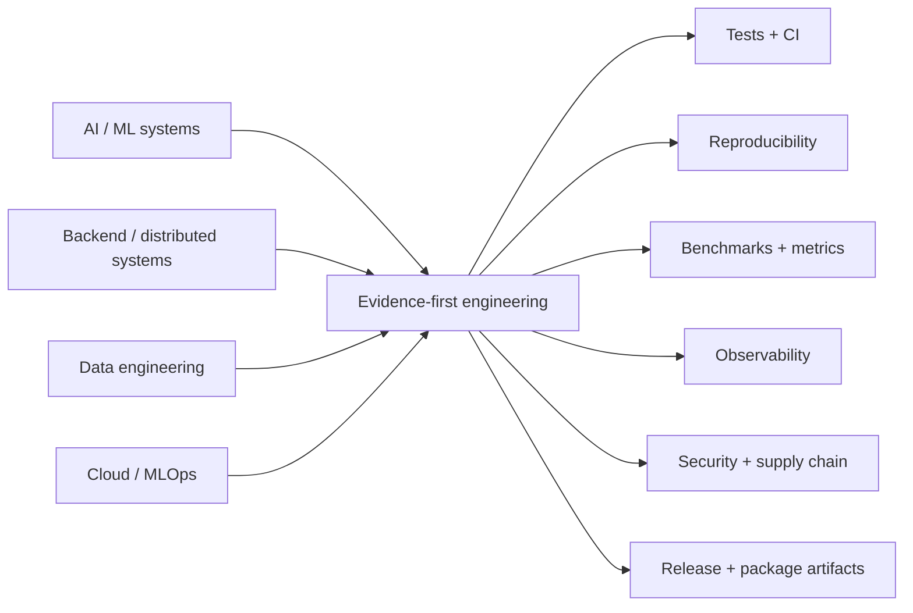
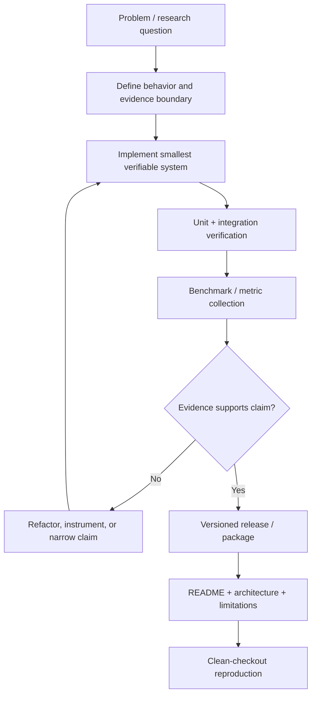

# 👋 Hi, I'm Corey Leath

[](https://github.com/CoreyLeath-code)
[](https://github.com/CoreyLeath-code?tab=repositories)
[](#technical-focus)
[](#engineering-evidence-model)

**Software Engineer | AI Engineer | MLOps | Distributed Systems**

I am a Software Development student focused on AI engineering, backend systems, data platforms, and production-oriented software. My portfolio is organized around one principle: **claims should be backed by code, tests, reproducible commands, versioned artifacts, or measured evidence.**

I build projects across machine learning, MLOps, distributed systems, cloud infrastructure, data engineering, and quantitative research, with an emphasis on maintainability, observability, release engineering, and honest benchmarking.

---

## Portfolio at a glance

| Area | What I build | Representative repositories |
|---|---|---|
| AI & Machine Learning | computer vision, NLP, recommendation systems, agentic runtimes | [TransformerForge](https://github.com/CoreyLeath-code/TransformerForge), [DeepSequence-Recommender](https://github.com/CoreyLeath-code/DeepSequence-Recommender), [Facial Emotion Recognition System](https://github.com/CoreyLeath-code/Facial-Emotion-Recognition-System), [HelixAgent](https://github.com/CoreyLeath-code/HelixAgent) |
| AI Infrastructure & MLOps | model operations, monitoring, deployment workflows, evidence pipelines | [SentinelAI](https://github.com/CoreyLeath-code/SentinelAI), [PredictiveMaintenance_IoT](https://github.com/CoreyLeath-code/PredictiveMaintenance_IoT), [AWS SageMaker Snowflake ML Pipeline](https://github.com/CoreyLeath-code/AWS-SageMaker-Snowflake-ML-Pipeline) |
| Backend & Distributed Systems | APIs, event-driven services, messaging, observability | [TrojanChat](https://github.com/CoreyLeath-code/TrojanChat), [LogSight-AI](https://github.com/CoreyLeath-code/LogSight-AI), [IntelliOps-AI](https://github.com/CoreyLeath-code/IntelliOps-AI), [Scalable Ride Sharing Platform](https://github.com/CoreyLeath-code/Scalable-Event-Driven-Ride-Sharing-Platform) |
| Data Engineering | ETL, data contracts, warehouses, reproducible pipelines | [NYC Finance Data Engineering](https://github.com/CoreyLeath-code/NYC-Finance-Data-Engineering-Project), [LoanDefaultRiskPredictor](https://github.com/CoreyLeath-code/LoanDefaultRiskPredictor) |
| Quantitative / Financial Systems | backtesting, research tooling, financial ML workflows | [Algo Quant Backtester](https://github.com/CoreyLeath-code/Algo-Quant-Backtester), [QUANT-LLM-ASSISTANT](https://github.com/CoreyLeath-code/QUANT-LLM-ASSISTANT) |
| Software Engineering | domain modeling, testing, packaging, reproducibility | [Software3-Lab](https://github.com/CoreyLeath-code/Software3-Lab), [ML Docker Orchestrator](https://github.com/CoreyLeath-code/ML-Docker-Orchestrator) |

---

## Portfolio architecture



## Engineering system design



This is the engineering loop I try to apply across the portfolio: **define the claim, implement it, test it, measure it, package it, and make it reproducible.**

---

## Featured engineering projects

| Repository | Engineering focus |
|---|---|
| [HelixAgent](https://github.com/CoreyLeath-code/HelixAgent) | durable agent runtime, governed tools, checkpoints, observability |
| [TransformerForge](https://github.com/CoreyLeath-code/TransformerForge) | summarization service, deterministic fallback, benchmark discipline |
| [SentinelAI](https://github.com/CoreyLeath-code/SentinelAI) | AI monitoring and reliability engineering |
| [DeepSequence-Recommender](https://github.com/CoreyLeath-code/DeepSequence-Recommender) | recommendation-system architecture and evaluation workflows |
| [LogSight-AI](https://github.com/CoreyLeath-code/LogSight-AI) | AIOps/log analytics and telemetry |
| [NYC Finance Data Engineering](https://github.com/CoreyLeath-code/NYC-Finance-Data-Engineering-Project) | contract-first ETL, reproducible benchmarking, release/supply-chain controls |
| [PredictiveMaintenance_IoT](https://github.com/CoreyLeath-code/PredictiveMaintenance_IoT) | predictive-maintenance service boundaries and packaged runtime |
| [Software3-Lab](https://github.com/CoreyLeath-code/Software3-Lab) | .NET domain modeling, xUnit verification, BenchmarkDotNet, GHCR packaging |

---

## Technical focus

### AI & machine learning
Python • PyTorch • TensorFlow • Hugging Face • CNNs • Transformers • recommendation systems • feature engineering • vector search

### MLOps & AI infrastructure
MLflow • Docker • Kubernetes • Terraform • GitHub Actions • Prometheus • OpenTelemetry • model/runtime evidence

### Backend & distributed systems
FastAPI • C#/.NET • Go • C++ • REST • gRPC • Redis • Kafka • event-driven architecture

### Data engineering
SQL • Pandas • PostgreSQL • Snowflake • ETL • data contracts • reproducible pipelines

### Software engineering
OOP • SOLID • clean architecture • design patterns • automated testing • static analysis • release engineering

---

## Engineering evidence model

A portfolio claim is strongest when it can point to a reproducible artifact.

| Claim type | Evidence I prefer |
|---|---|
| Correctness | deterministic tests, fixtures, CI logs, test artifacts |
| Performance | benchmark command, warm-up policy, sample count, environment, commit SHA, raw result artifact |
| ML quality | dataset version, split protocol, seed, metric definition, uncertainty, leakage controls |
| Runtime behavior | health/readiness checks, logs, metrics, trace context, failure behavior |
| Packaging | Dockerfile, image tag, digest, GHCR package, checksum |
| Security | dependency scan, image scan, SBOM, SAST, secret scanning |
| Release quality | semantic version, changelog, source archive, checksum, immutable package |

### Evidence boundary

I avoid treating the following as equivalent:

- a unit-test pass rate and code coverage
- a microbenchmark and production throughput
- synthetic data performance and real-world model quality
- a Docker image and production authorization
- a repository diagram and a deployed distributed system
- a technology listed in an experiment and a verified default runtime dependency

---

## Quick start: evaluating this portfolio

If you are reviewing the portfolio as an engineer or recruiter, a practical path is:

```bash
# 1. Pick a repository
# 2. Read README + architecture + limitations
# 3. Inspect CI/workflows and tests
# 4. Run the documented clean-checkout command
# 5. Compare any metric claim with its evidence artifact
# 6. Inspect the release/package when one is published
```

Recommended repositories for different review goals:

- **Agent systems:** HelixAgent
- **AI service design:** TransformerForge
- **MLOps / monitoring:** SentinelAI
- **Data engineering:** NYC-Finance-Data-Engineering-Project
- **Distributed/event-driven systems:** Scalable-Event-Driven-Ride-Sharing-Platform
- **C#/.NET engineering:** Software3-Lab

---

## Reproducibility standard

For projects with benchmark or ML evidence, I aim to record:

1. exact command
2. commit SHA or release tag
3. runtime and dependency versions
4. dataset/fixture provenance
5. random seed when applicable
6. warm-up and measurement policy
7. sample count / repeat count
8. machine or CI-runner context
9. raw machine-readable result
10. interpretation and limitations

A number without this context is treated as exploratory rather than portfolio-grade evidence.

---

## Research-style benchmark policy

### Research question

A benchmark should answer a narrow engineering question, for example:

> Under a defined runtime and workload, what are the latency, throughput, allocation, or resource characteristics of the specific code path being measured?

### Minimum protocol

| Element | Expected record |
|---|---|
| Workload | exact operation being measured |
| Environment | OS, CPU/runner, runtime, dependency versions |
| Warm-up | explicit warm-up count or rationale |
| Samples | iteration/repeat count |
| Statistics | median/mean plus tail or dispersion where appropriate |
| Provenance | commit SHA or release tag |
| Output | machine-readable artifact where practical |
| Limits | what the benchmark does **not** measure |

### Metrics I treat carefully

- latency: p50 / p95 / p99 when sample size supports them
- throughput: measured directly when possible; clearly labeled when derived
- memory/allocation: per operation or process-level, depending on workload
- correctness: pass/fail is not the same as coverage
- ML metrics: accuracy/F1/AUC are incomplete without dataset and split context
- service capacity: requires concurrency, saturation, errors, and resource observations

---

## Release and package philosophy

For repositories that contain a real runnable artifact, I prefer:

```text
source
  ↓
CI / security gates
  ↓
semantic version tag
  ↓
GitHub Release
  ├── source artifact
  └── checksum
  ↓
GHCR / package registry
  └── versioned runtime image
```

A package badge is useful only when the underlying package actually builds and can be pulled.

---

## Extended reviewer Q&A

**Are all repositories production systems?**  
No. They range from research and portfolio reference implementations to more complete service/runtime projects. Each repository should state its own evidence boundary.

**Do benchmark numbers prove production capacity?**  
No. Microbenchmarks characterize specific code paths under controlled conditions. Production capacity requires representative I/O, concurrency, saturation, failure, and resource testing.

**Why publish GitHub Releases and GHCR packages?**  
A release provides a versioned source snapshot and change history. A GHCR package provides a versioned execution artifact that can be pulled independently of a local build.

**How do you handle unsupported claims?**  
I prefer narrowing or removing the claim rather than keeping an impressive-sounding statement that the code or evidence cannot reproduce.

**What matters most in an AI portfolio?**  
Beyond model usage: evaluation discipline, data provenance, failure behavior, reproducibility, observability, security boundaries, and the ability to explain tradeoffs.

**What matters most in distributed-system projects?**  
Explicit contracts, retries/idempotency, ordering assumptions, backpressure, failure recovery, observability, and real integration tests around external systems.

**What matters most in MLOps projects?**  
Lineage, reproducible evaluation, promotion policy, immutable artifacts, rollback, monitoring, and clear separation between pipeline orchestration and evidence of model quality.

**What do you optimize for when documenting projects?**  
Fast reviewer comprehension: what the system does, what it does not do, how to run it, where the important code is, what was measured, and how to reproduce the result.

---

## Engineering roadmap

### Phase 1 — Evidence consistency
- align README claims with current code and workflows
- remove stale or duplicated technology claims
- keep benchmark numbers tied to versioned evidence
- keep release/package badges connected to real artifacts

### Phase 2 — Integration depth
- increase live dependency testing where broker/database adapters exist
- add failure-injection cases for retries, timeouts, and degraded dependencies
- document idempotency and recovery behavior

### Phase 3 — Evaluation rigor
- version representative datasets and fixtures
- publish explicit split/seed protocols for ML projects
- add uncertainty, calibration, and subgroup analysis where relevant
- separate engineering benchmarks from model-quality findings

### Phase 4 — Supply-chain maturity
- expand SBOM and image-signing coverage
- pin deployable artifacts by digest
- improve release provenance and reproducible build evidence

### Phase 5 — System-level evidence
- add representative end-to-end load tests to the projects that need them
- record saturation/error curves rather than single latency numbers
- add resource and cost observations where cloud infrastructure is part of the claim

---

## Connect

- **GitHub:** [CoreyLeath-code](https://github.com/CoreyLeath-code)
- **LinkedIn:** [Corey Leath](https://www.linkedin.com/in/corey-leath)

---

> Build the system. Test the claim. Measure the result. Publish the evidence.
